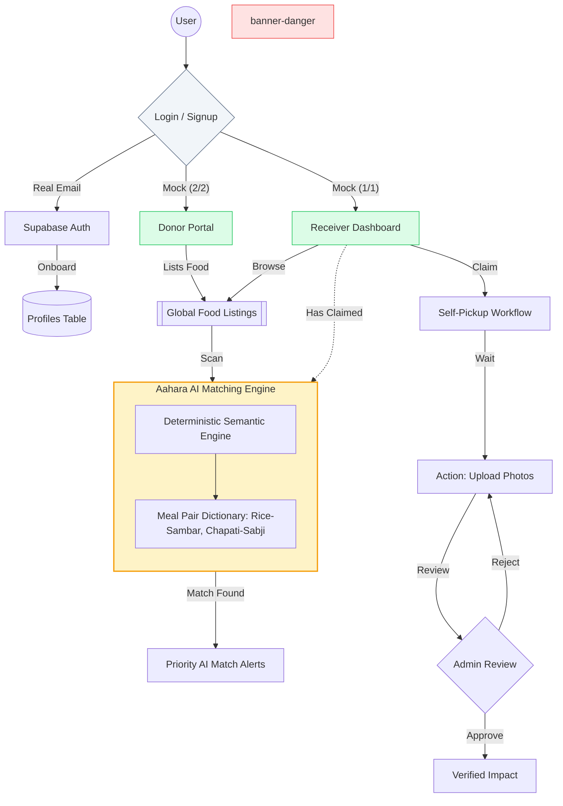

# Aahara Setu | System Architecture

A high-level overview of the **Aahara Setu** role-based architecture and the **Aahara AI Matching Engine**.

---

## 🏗️ Technical Flow

---

## 🛠️ Components Breakdown

### 1. **Identity & Routing (`App.tsx`)**
The "Gatekeeper" of the system. It listens to `localStorage` changes to dynamically render the **Donor UI** or **Receiver UI**. It ensures that a Receiver can never access donor upload tools, preserving role integrity.

### 2. **Aahara AI Matching Engine (`AaharaAI.ts`)**
A pattern-recognition engine that identifies complementary nutrition.
- **Core-to-Complement Mapping**: Automatically links "Core" carbohydrates (Rice, Roti) with "Complementary" nutrients (Sambar, Sabji, Dal).
- **Match Alerts**: Triggers real-time UI badges ("Complete Meal Match Found") when a donor lists something that would complete a receiver's current meal.

### 3. **Verification Loop (`Receiver.tsx`)**
A trust-based system designed to prevent food waste.
- **2-Order Limit**: Reaching 2 unverified orders triggers an **Account Lock**.
- **Proof of Utilization**: Requires 3+ photos showing the food being consumed/distributed.
- **Admin Verification**: Moves items from `proof_submitted` to `completed` to unlock the account profile.

### 4. **Self-Pickup Logistics**
Replaced traditional "Delivery" tracking with a decentralized model where the **Receiver** is responsible for local pickup, supported by time-deadline indicators.

---

> [!TIP]
> **Extensibility**: This architecture is designed to swap the current `AaharaAI.ts` (deterministic logic) with a real-time **Gemini AI API** or **LLM** without changing the frontend UI components.
